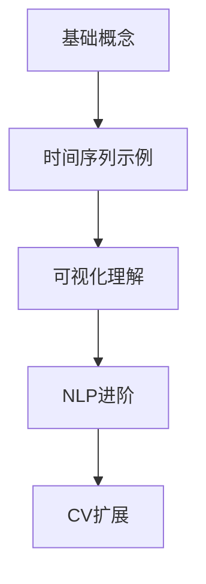

&emsp;&emsp;今天学习注意力机制（[Attention Mechanism](https://towardsdatascience.com/hands-on-attention-mechanism-for-time-series-classification-with-python/)）。
<!--less-->
&emsp;&emsp;注意力机制的核心思想是让模型能够动态聚焦于输入数据中最相关的部分。在时间序列分类中：
工作原理：

通过计算每个时间步的"重要性分数"（attention score）

使用softmax函数将这些分数转换为0-1之间的权重

对时间步特征进行加权求和，生成上下文向量（context vector）
数学表示：

   $e_i = f(h_i)$  # 计算每个隐藏状态h_i的能量分数
   $α_i = exp(e_i) / Σ exp(e_j)$  # softmax归一化
   $context = Σ (α_i * h_i)$  # 加权上下文向量
与传统模型的对比：

|模型类型 |处理变长异常能力 |可解释性 |计算效率|
|-------|------|------|------|
|FFN |❌ 固定位置依赖 |❌ 黑盒 |⭐⭐⭐⭐|
|CNN |△ 局部感受野 |△ 中等 |⭐⭐⭐⭐|
|Attention | ✅ 动态聚焦| ✅ 高（权重可视化）| ⭐⭐⭐|

双向LSTM（BiLSTM）
作用：作为特征提取器，捕获时间序列的前后依赖关系

双向性：同时考虑过去和未来信息
  
  前向：h_forward = LSTM(从t=0到t=T)
  后向：h_backward = LSTM(从t=T到t=0)
  最终状态：h = [h_forward; h_backward]

异常检测机制

!```mermaid
!graph LR
forwardchart TD
A[原始正弦波] --> B[随机位置]
--> C[插入平坦段]
--> D[长度随机]
--> E[振幅/频率随机]
--> F[形成异常样本]
!```
模型架构

```python
AttentionModel(
  (lstm): LSTM(1, 32, bidirectional=True)
  (attention): Sequential(
    (0): Linear(in_features=64, out_features=64)
    (1): Tanh()
    (2): Linear(in_features=64, out_features=1)
  )
  (classifier): Sequential(
    (0): Linear(in_features=64, out_features=1)
    (1): Sigmoid()
  )
)
```

评估指标
ROC-AUC：衡量模型区分正负样本的能力

值域[0,1]，>0.9表示优秀模型
F1-Score：精确率和召回率的调和平均
```
   F1 = 2  (Precision  Recall) / (Precision + Recall)
``` 
混淆矩阵：

   |            |预测正常  |  预测异常|
   |------|------|------|
   |实际正常   |TN (真负例)  |FP (假正例)|
   |实际异常   |FN (假负例)  |TP (真正例)|
   

"学习注意力机制的最佳途径不是NLP而是时间序列"
优势：
1. 复杂度降低：
### NLP需要词嵌入/位置编码等额外层
### 时间序列可直接使用原始数值数据
### 示例：NLP处理流程 vs 时间序列处理
```
     # NLP
     文本 → 分词 → 嵌入 → 位置编码 → 注意力
     # 时间序列
     原始信号 → 注意力
``` 
2. 直观可视化：
  时间序列的注意力权重可直接叠加在信号图上
  NLP的注意力热力图需要专业知识解释
3. 计算效率：
  时间序列可生成小型合成数据集（文中5000样本）
  训练在CPU上仅需几分钟（NLP模型通常需要GPU小时级训练）

局限性：
1. 语义理解缺失：
 NLP任务能更好展示注意力处理语义关系的能力
 如：指代消解"The animal didn't cross the street because it was too tired"
2. 实际应用偏差：
  工业界注意力应用仍以NLP为主（BERT, GPT等）
  时间序列注意力研究相对较少

改进建议:
1. 混合学习路径（推荐）



2. 增强时间序列实验设计
  多类型异常：
``` python
  # 当前：仅平坦异常
  wave[loc:end] = wave[loc] 
  
  # 建议增加：
  wave[loc:end] = 0  # 零值异常
  wave[loc:end] = random_noise()  # 噪声异常
  wave = add_spike(loc)  # 尖峰异常
``` 
多变量时间序列：
``` python
    # 当前：单变量正弦波
  X.shape = (5000, 500, 1)
  
  # 改进：多变量
  X_multi = np.stack([sine_wave, 
                      cosine_wave, 
                      random_walk], axis=-1)
```
3. 模型架构优化

多头注意力（Multi-Head Attention）：
``` python
    # 当前：单头
  self.attention = nn.Sequential(...)
  
  # 改进：多头
  self.multihead_attn = nn.MultiheadAttention(
      embed_dim=64, num_heads=4
  )
``` 
位置编码增强：
``` python
    # 当前：依赖LSTM的顺序处理
  # 改进：显式位置编码
  position = torch.arange(0, seq_len).unsqueeze(1)
  pe = torch.sin(position / 10000(2*i/d_model))
``` 
4. 可解释性增强

定量评估指标：
``` python
    def attention_accuracy(att_weights, anomaly_loc):
      """计算注意力聚焦异常区域的准确度"""
      focus_region = att_weights.argmax()-10 : att_weights.argmax()+10
      overlap = len(set(focus_region) & set(anomaly_loc))
      return overlap / len(anomaly_loc)
``` 
对比可视化：

|样本类型 |正常样本| 异常样本|
|------|------|------|
|注意力分布| 均匀分布| 峰值在异常区|
|典型模式| | |

时间序列提供了更简洁直观的注意力学习路径。但在工业实践中，建议：
1. 以时间序列作为入门起点

2. 通过NLP任务深化语义理解

3. 最终扩展到多模态应用

"注意力机制不是领域特定的工具，而是数据关系的动态透镜——时间序列提供了最干净的镜片来观察其本质。"
