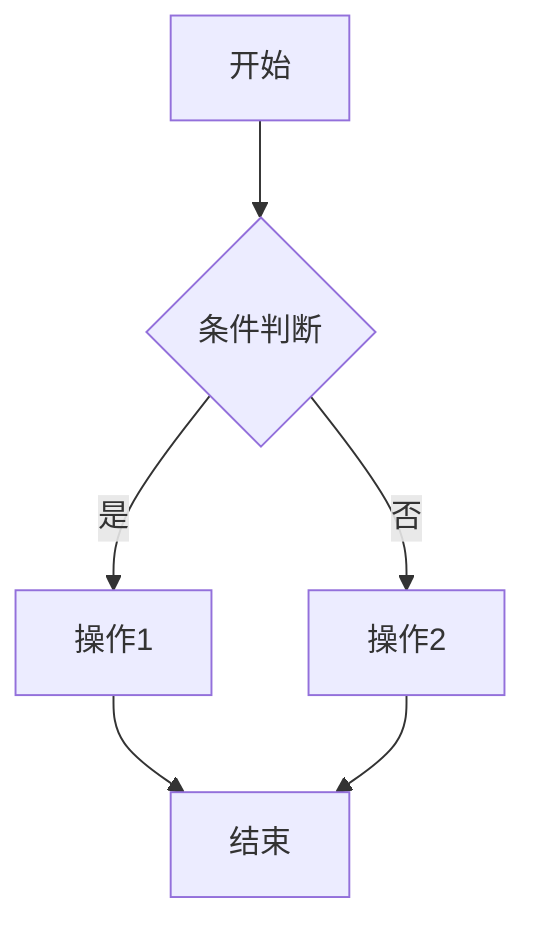

&emsp;&emsp;那么Hexo下如何画流程图呢？
<!--less-->
&emsp;&emsp;因为Hexo是用的Markdown的语法，所以是指Markdown的语法。这里我用的是mermaid。用之前需要安装啊。

```
npm install hexo-filter-mermaid-diagrams --save
```

然后
在三个反引号+mermaid和三个反引号之间输入:

graph TD
A[开始] --> B{条件判断}
B -->|是| C[操作1]
B -->|否| D[操作2]
C --> E[结束]
D --> E

就会生成:


大功告成。
