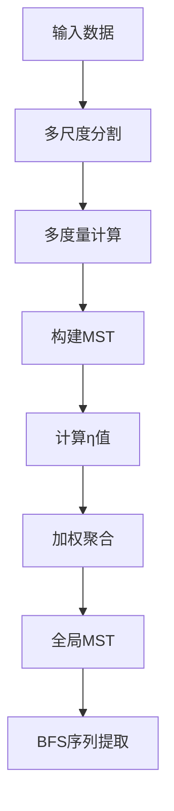

&emsp;&emsp;今天学习Sequencer。
<!--less-->
&emsp;&emsp;什么是Sequencer？具体请参见[这篇文章](https://github.com/dalya/Sequencer/blob/master/Sequencer_paper.pdf)。脚本在[这里](https://github.com/dalya/Sequencer)。不想看？那就看我得了。

# Sequencer是什么？

Sequencer是一种无监督算法，旨在从复杂数据中自动识别主要的一维连续趋势。它通过分析数据对象之间的相似性图结构，无需预定义特征、参数调整或领域知识，直接处理原始数据（如像素、光谱值）来发现隐藏的全局序列。其核心创新在于：

 * 通用性：适用于任意一维数据（光谱、时间序列、图像行等）。
 * 自动化：自动选择最优的相似性度量和分析尺度。
 * 可解释性：输出物理意义明确的序列（如温度梯度、红移序列）。

# 工作原理
  * 核心思想：最小生成树（MST）的几何特征
  * 关键假设：连续趋势会生成细长的MST，随机数据则产生紧凑的MST。
  * 量化指标：伸长率（Elongation）,$\eta=a/b$
  a：MST平均高度（从最不连通节点到其他节点的最短路径均值）
  b：MST平均宽度（按层级分组的节点数均值）
  * 物理意义：$\eta$ 越大，数据越接近一维序列。
# 算法流程


&emsp;&emsp;步骤详解如下：

 1. 多尺度分割
   将每个数据对象（如400像素光谱）分割为不同尺度的片段（例：从完整对象到20像素小段）。
目的：捕获局部和全局趋势。
 2. 多度量计算
   对每个（尺度, 片段）组合，用4种度量计算距离矩阵：
   * 欧氏距离（整体形状）
   * KL散度（概率分布差异）
   * 地球移动距离（EMD）（位移敏感）
   * 能量距离（分布差异）
   为什么多度量？ 不同度量揭示不同特征（如EMD检测谱线位移，欧氏距离捕捉整体形态）。
 3. MST构建与η计算
   对每个（度量, 尺度, 片段）生成距离矩阵$\rightarrow$构建MST$\rightarrow$计算伸长率$ \eta_{klm} $。例（文章图3）：窄脉冲数据在小尺度（l=4,5）的欧氏距离获得高$\eta$，指示局部趋势。
 4. 信息聚合
   * 片段聚合：对固定（度量,尺度），用$\eta$加权平均各片段距离矩阵：$ D_{kl}=\langle \eta_{klm} \cdot D_{klm}\rangle_{m} $
   * 全局聚合：用$\eta$加权合并所有MST的边，构建全局邻近矩阵：
$$ P_{combined}=\langle \eta_{kl}\cdot \# edges(MST_{kl})\rangle_{kl} $$
 5. 序列提取
   构建全局MST$\rightarrow$从最不连通节点开始广度优先搜索（BFS），生成最终序列顺序。

# 输出数据的理解
  1. 序列顺序：输出为数据对象的有序索引列表，相邻对象在主导度量和尺度下最相似。
  2. 物理意义：
  * 恒星光谱（图4a）：序列对应温度梯度（顶部高温恒星→底部低温恒星）。
  * 类星体光谱（图4b）：序列反映红移变化（谱线系统性位移）。
  * 地震波数据（图5）：序列揭示地理结构差异（沉积盆地→火成岩区）。
  3. 可视化建议：将重排后的数据矩阵按序列索引显示，观察连续变化模式（如移动的谱线、渐变纹理）。

# 使用注意事项
    1. 数据预处理
    * 归一化：算法内部对每个数据段执行总和归一化（sum=1），无需额外操作。
    * 高动态范围数据：建议对数缩放（如亮度值）避免少数像素主导。
    * 缺失值：需插值或剔除，否则距离度量失效。
    2. 计算优化
    * 大数据集（$ N>10^4 $）：
     ** 启用子采样模式（见7.3节）：
     1. 在小样本（$N_{s}<< N$ ）构建初始序列。
     2. 按锚点（$f_{A}N_{s}$）逐步插入剩余点。
     ** 复杂度：从O($N^2$)降至O($N\logN$)。
   * 并行化：各（度量,尺度,片段）计算相互独立，可并行加速。
   3. 结果验证
   * 检查高$\eta$度量：分析主导趋势的度量（如EMD指示位移，KL散度捕获分布变化）。
   * 残差分析（见5.1节）：
   ** 沿序列方向平滑数据$\rightarrow$比较原始值与平滑值的残差。
大残差可能指示异常点或次级趋势。
   ** 对比降维方法：用归一化伸长率$ \eta\prime=\eta/N $评估t-SNE/UMAP结果（图7,8）。
   4. 局限性
   * 噪声敏感：信噪比<5时趋势可能被掩盖（建议先筛选高信噪比子集）。
   * 多维数据：算法设计为一维输入，需展平多维数据（如将图像转为行向量）。
   * 序列唯一性：复杂数据可能存在多个有效序列（需领域知识判断主导趋势）。


```python
import os
import glob
import numpy as np
from obspy import read
from obspy.signal.cross_correlation import correlate
import matplotlib.pyplot as plt

# 设定文件夹路径和文件匹配模式
folder_path = './processed_sac/'
file_pattern = os.path.join(folder_path, '20111122T184816*BHZ*.sac')
file_list = sorted(glob.glob(file_pattern))

# 设定滤波参数
lowcut = 0.05
highcut = 2.0
filter_params = {'lowcut': lowcut, 'highcut': highcut, 'corners': 4, 'method': 'bandpass'}

# 用于存储最终数据的列表
data_list = []

def calculate_time_shift(signal1, signal2, dt, max_shift_seconds=10):
    """
    计算两个信号之间的时移，返回时移（秒）。
    参数 max_shift_seconds 控制最大允许的滞后量。
    """
    max_shift_samples = int(max_shift_seconds / dt)  # 最大允许滞后对应的样本数
    correlation = correlate(signal1, signal2, max_shift_samples, demean=True, normalize=True)
    lag = np.argmax(correlation) - max_shift_samples
    lag_time = lag * dt  # 使用采样间隔转换索引为时间
    return lag_time

# 读取 SAC 文件并进行处理
for file in file_list:
    # 读取 SAC 文件
    st = read(file)
    tr = st[0]  # 假设每个文件只有一个 Trace
    # 获取数据和采样间隔
    data = tr.data
    dt = tr.stats.delta  # 采样间隔
    # 判断是否全为零，如果是，跳过
    if np.all(data == 0):
        print(f"{file} 数据全为零，跳过。")
        continue
    # 滤波处理（使用 `obspy` 内建的滤波方法）
    tr.filter(type='bandpass', freqmin=lowcut, freqmax=highcut, corners=filter_params['corners'])
    filtered_data = tr.data  
    # 归一化
    depmin = np.min(filtered_data)
    depmax = np.max(filtered_data)
    if depmax != depmin:
        normalized_data = (filtered_data) / (depmax - depmin)
    else:
        normalized_data = filtered_data  # 如果最大值等于最小值，直接使用原数据  
    data_list.append(normalized_data)
# 假设我们想要对第一个信号进行时移校正，将所有其他信号与第一个信号对齐
data=data_list
base_signal = data_list[0]
time_shifts = []
# 对每个信号与基准信号计算时移
for i, signal in enumerate(data_list[1:], start=1):
    time_shift = calculate_time_shift(base_signal, signal, dt)
    time_shifts.append(time_shift)
    print(f"信号 {i+1} 与基准信号的时移: {time_shift:.4f} 秒")
    # 平移信号
    shift_samples = int(round(time_shift / dt))  # 转换为样本数，并取整
    if shift_samples > 0:
        shifted_signal = np.concatenate((np.zeros(shift_samples), signal[:-shift_samples]))
    elif shift_samples < 0:
        shifted_signal = np.concatenate((signal[-shift_samples:], np.zeros(-shift_samples)))
    else:
        shifted_signal = signal
    # 更新信号为平移后的信号
    data_list[i] = shifted_signal
# 转换成一个二维数组，方便作为 sequencer 的输入
data_array = np.array(data_list)
# 打印一下结果，检查是否符合要求
print(data_array.shape)
import matplotlib.pyplot as plt
import sequencer
objects_list_simulated = np.vstack(data_array)
num_rows = objects_list_simulated.shape[0]
print(num_rows)
shuffled_indices = np.random.permutation(num_rows)
#shuffled_indices = np.arange(23)
print(shuffled_indices)
objects_list_shuffled = objects_list_simulated[shuffled_indices, :]
# 确保没有零值或负值
#objects_list_shuffled = np.maximum(objects_list_shuffled, 1e-16)  # 或者加上偏移量
#objects_list_shuffled = np.maximum(objects_list_shuffled, 1e-16)  # 或者加上偏移量
objects_list_shuffled = objects_list_shuffled+1.0

plt.figure(1, figsize=(10, 5))
plt.subplot(1,2,1)
plt.title("input dataset [lines]")
for j, object_data in enumerate(data):
    grid = np.arange(len(object_data))  # 创建与 object_data 长度相同的 x 轴
    object_data_scaled_y = object_data + (j-1) *1.0  # 缩放以避免重叠
    plt.plot(grid, object_data_scaled_y)
plt.xlabel("x")
plt.ylabel("scaled intensity")

plt.subplot(1,2,2)
plt.title("input dataset [heat]")
plt.pcolormesh(objects_list_shuffled,cmap='inferno')
plt.colorbar()
plt.xlabel("x")
plt.ylabel("original index")
plt.tight_layout()


# 跑sequencer
output_path = "sequencer_output_directory"
if not os.path.exists(output_path):
    os.makedirs(output_path)
# 初始化 sequencer 对象
estimator_list = ['EMD', 'energy', 'L2']
seq = sequencer.Sequencer(grid, objects_list_shuffled, estimator_list)
# 执行 sequencer
final_elongation, final_sequence = seq.execute(output_path)

# first example
estimator_name = 'EMD'
scale = 1
print("Intermediate elongation for metric=%s and scale=%s: %s" % (estimator_name, scale, 
                                                                  seq.return_elongation_of_weighted_products(estimator_name, scale)))
# second example
estimator_list, scale_list, elongation_list = seq.return_elongation_of_weighted_products_all_metrics_and_scales()
for i in range(len(estimator_list)):
    print("metric=%s, scale=%s, elongation: %s" % (estimator_list[i], 
                                                   scale_list[i], 
                                                   elongation_list[i]))

# 画图
estimator_list, scale_list, sequence_list = seq.return_sequence_of_weighted_products_all_metrics_and_scales()

#fig, axs = plt.subplots(2, 2, figsize=(12, 10))
plt.figure(1, figsize=(16, 16))
plt.subplot(2, 2, 1)
#plt.title("input dataset")
#plt.pcolormesh(objects_list_shuffled)
#plt.colorbar()
#plt.xlabel("x")
#plt.ylabel("original index")

for j, object_data in enumerate(objects_list_shuffled):
    grid = np.arange(len(object_data))  # 创建与 object_data 长度相同的 x 轴
    object_data_scaled_y = object_data + (j-1) * 1  # 缩放以避免重叠
    plt.plot(grid, object_data_scaled_y)
plt.xlabel("x")
plt.ylabel("Original")

plt.subplot(2, 2, 2)
plt.title("ordered according to\n intermediate sequence using: \n metric=%s, scale=%s" % (estimator_list[0], scale_list[0]))
sequnce = sequence_list[0]
#plt.pcolormesh(objects_list_shuffled[sequnce])
#plt.colorbar()
#plt.xlabel("x")
#plt.ylabel("original index")
for j, object_data in enumerate(objects_list_shuffled[sequnce]):
    grid = np.arange(len(object_data))  # 创建与 object_data 长度相同的 x 轴
    object_data_scaled_y = object_data + (j-1) * 1  # 缩放以避免重叠
    plt.plot(grid, object_data_scaled_y)
plt.xlabel("x")
plt.ylabel("Original")

plt.subplot(2, 2, 3)
plt.title("ordered according to\n intermediate sequence using: \n metric=%s, scale=%s" % (estimator_list[1], scale_list[1]))
sequnce = sequence_list[1]
#plt.pcolormesh(objects_list_shuffled[sequnce])
#plt.colorbar()
#plt.xlabel("x")
#plt.ylabel("original index")
for j, object_data in enumerate(objects_list_shuffled[sequnce]):
    grid = np.arange(len(object_data))  # 创建与 object_data 长度相同的 x 轴
    object_data_scaled_y = object_data + (j-1) * 1  # 缩放以避免重叠
    plt.plot(grid, object_data_scaled_y)
plt.xlabel("x")
plt.ylabel("Original")

plt.subplot(2, 2, 4)
plt.title("ordered according to\n intermediate sequence using: \n metric=%s, scale=%s" % (estimator_list[2], scale_list[2]))
sequnce = sequence_list[2]
#plt.pcolormesh(objects_list_shuffled[sequnce])
#plt.colorbar()
#plt.xlabel("x")
#plt.ylabel("original index")
for j, object_data in enumerate(objects_list_shuffled[sequnce]):
    grid = np.arange(len(object_data))  # 创建与 object_data 长度相同的 x 轴
    object_data_scaled_y = object_data + (j-1) * 1  # 缩放以避免重叠
    plt.plot(grid, object_data_scaled_y)
plt.xlabel("x")
plt.ylabel("Original")

plt.tight_layout()
```
